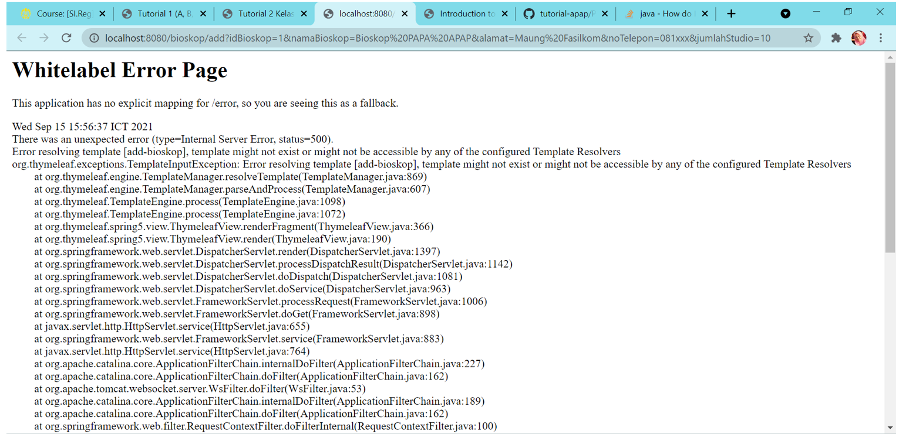
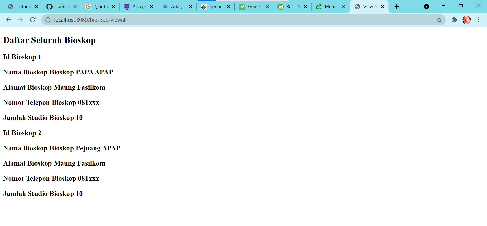

# Tutorial APAP
## Authors
* **Karina Aulia Putri** - *1906298954* - *C*
--- 
## Tutorial 6
1. **Jelaskan secara singkat perbedaan Otentikasi dan Otorisasi! Di bagian mana (dalam kode yang telah anda buat) konsep tersebut diimplementasi?**
 
**Otentikasi** adalah proses ketika memeriksa apakah user terdaftar dalam database sistem dan memberikan izin pengaksesan kepada user yang valid (tersimpan datanya).
Sedangkan, **otorisasi** adalah proses ketika kita ingin memeriksa user yang memiliki hak ases terhadap suatu bagian sistem tertentu (halaman, fitur, dsb).
  **Contoh penerapan di tutorial ini**  
- Otentiksasi: Bagian Login -> 
  @Autowired public void configAuthentication(AuthenticationManagerBuilder auth) throws Exception{auth.userDetailsService(userDetailsService).passwordEncode(encoder());}
- Otorisasi: hanya role "ADMIN" yang bisa melihat list semua user -> 
  .antMatchers("/user/viewall").hasAuthority("ADMIN")

3. **Apa itu BCryptPasswordEncoder? Jelaskan secara singkat cara kerja dan tujuannya.**
  BCryptPasswordEncoder adalah implementasi default dari algoritma BCrypt, sebuah fungsi hashing yang dapat menjadikan password lebih aman 
dengan melakukan enskripsi password menjadi random string.

4. **Apakah penyimpanan password sebaiknya menggunakan encryption atau hashing? Mengapa
   demikian?**
  Penyimpanan password sebaiknya menggunakan **hashing**. Dikarenakan jika dengan encryption kita bisa saja mendapatkan password asli dari password yang sudah di encode jika kita memiliki kunci untuk decoding.
Namun, jika dengan hashing maka password asli tidak dapat diketahui oleh orang lain karena nilai hash yang dihasilkan tidak dapat diubah.
5. **Jelaskan secara singkat apa itu UUID beserta penggunaannya!**
  UUID adalah sebuah string 32 karakter yang digenerate secara random dan nilainya unik. Penggunaannya sebagai ID yang dapat mengidentifikasi suatu informasi secara unik.
6. **Apa kegunaan class UserDetailsServiceImpl.java? Mengapa harus ada class tersebut?**
  class UserDetailsServiceImpl.java digunakan untuk mengambil informasi autentikasi dan otorisasi pengguna. Method loadUserByUsername() berguna untuk memasukkan informasi user ke API Spring security.

## Tutorial 5
1. **Apa itu Postman? Apa kegunaannya?**
     Postman adalah platform API untuk membangun dan menggunakan API. Postman berfungsi sebagai REST CLIENT untuk uji coba REST API dan digunakan sebagai tools untuk menguji API.
2. **Jelaskan fungsi dari anotasi @JsonIgnoreProperties dan @JsonProperty**  
   - @JsonIgnoreProperties digunakan untuk mengabaikan suatu property sehingga properti tersebut tidak dimasukkan dalam JSON serialization dan deserialization.
   - @JsonProperty mendefinisikan properti logis yang digunakan dalam serialization dan deserialization pada JSON.
3. **Apa kegunaan atribut WebClient?**  
   Non-blocking dan reactive client yang digunakan untuk melakukan HTTP requests. Dengan atribut webclient, di tutorial ini saya dapat menyambungkan ke uri API dengan metode get untuk mendapatkan output.
4. **Apa itu ResponseEntity dan BindingResult? Apa kegunaannya?**
   - ResponseEntity berisi seluruh response yang didapatkan dari HTTP requests. Dengan Response Entity, kita dapat mengontrol elemen yang berada di dalamnya, seperti header, body, dan status code.
   - BindingResult adalah objek Spring yang menyimpan hasil validasi dan binding serta berisi error yang mungkin terjadi.
## Tutorial 4
1. **Jelaskan perbedaan th:include dan th:replace!**
     misalnya saya memiliki sebuah '<div', jika saya menggunakan th:include, maka fragment akan ditaruh di dalam div.
   Akan tetapi jika saya menggunakan th:replace, maka fragments akan menggantikan div dengan keseluruhan kode dari fragment.
2. **Jelaskan apa fungsi dari th:object!**
     th:object digunakan untuk mengikat suatu object. Dengan demikian, kita dapat menggunakan atribut dari object tersebut tanpa melakukan pemanggilan secara spesifik
   terhadap objek. Seperti yang digunakan pada form-add-penjaga.html, yaitu th:object="${penjaga}" dan th:field="*{bioskop}".* Tanpa menggunakan th:object,
   th:field perlu dispesifikan objeknya, misalnya seperti th:field="*{penjaga.bioskop}".
3. **Jelaskan perbedaan dari * dan $ pada saat penggunaan th:object! Kapan harus dipakai?**
     $ merupakan _variable expressions_ yang digunakan ketika ingin menunjuk kepada suatu object, sedangkan * 
   merupakan _selection expressions_ yang digunakan untuk menunjuk kepada atribut dari suatu object.

## Tutorial 3
1. **Tolong jelaskan secara singkat apa kegunaan dari anotasi-anotasi yang ada pada model
   (@AllArgsConstructor, @NoArgsConstructor, @Setter, @Getter, @Entity, @Table)**
   - @AllArgsConstructor membuatkan sebuah constructor dengan satu parameter untuk tiap
   field pada class. Secara default, constructor yang dibuat bertipe public.
   - @NoArgsConstructor membuatkan sebuah constructor tanpa parameter, perlu set attribute
     force=true apabila ada field yang tidak diset final.
   - @Setter dan @Getter digunakan untuk membuat sebuah Setter dan Getter secara otomatis.
   - @Entity digunakan untuk mengubah JavaBean menjadi sebuah entity dengan tujuan agar dapat
     memanipulasi database.
   - @Table digunakan untuk mengubah nama tabel database, jika tidak menggunakan @Table, by default
     adalah nama tabelnya = nama class.
   
2. **Pada class BioskopDB, terdapat method findByNoBioskop, apakah kegunaan dari method
   tersebut?**
    findByNoBioskop disitu sama seperti method findById, dimana pada BioskopModel telah diset @Id
   adalah noBioskop, sehingga  method ini akan mencari bioskop berdasarkan Idnya yaitu noBioskop.

3. **Jelaskan perbedaan kegunaan dari anotasi @JoinTable dan @JoinColumn**
     @JoinTable menyimpan Id dari tiap entity di tabel yang terpisah dan menampung relasi yang ada, sedangkan @JoinColumn
   menyimpan Id di kolom baru pada tabel yang sama.

4. **Pada class PenjagaModel, digunakan anotasi @JoinColumn pada atribut bioskop, apa
   kegunaan dari name, referencedColumnName, dan nullable dalam anotasi tersebut? dan apa
   perbedaan nullable dan penggunaan anotasi @NotNull**
    PenjagaModel memiliki hubungan ManytoOne dengan BioskopModel, dimana tiap penjaga memiliki satu bioskop yang tersimpan.
   name = "no_bioskop", referencedColumnName = "noBioskop" menunjukkan bahwa kita ingin membuat sebuah kolom no_bioskop yang merujuk kepada
   noBioskop yang merupakan Id dari BioskopModel. nullable digunakan untuk memperbolehkan kolom no_bioskop memiliki nilai
   null, sedangkan @NotNull melarang nilai dari field yang memiliki anotasi @NotNull berisi null. 

5. **Jelaskan kegunaan FetchType.LAZY, CascadeType.ALL, dan FetchType.EAGER**
    FetchType.Eager mengambil data dari tabel beserta data dari semua relasi yang dimiliki tabel, FetchType.LAZY hanya mendapatkan
   data dari tabel yang dituju saja tanpa relasinya, sedangkan CascadeType.ALL mengakibatkan ketika kita mengubah suatu entity (misal: remove), maka entity
   yang memiliki relasi dengan entity tersebut juga ikut diubah. 

## Tutorial 2
1. **Cobalah untuk menambahkan sebuah Bioskop dengan mengakses link berikut:
   [http://localhost:8080/bioskop/add?idBioskop=1&namaBioskop=Bioskop%20PAPA%20
   APAP&alamat=Maung%20Fasilkom&noTelepon=081xxx&jumlahStudio=10 ]()
   Apa yang terjadi? Jelaskan mengapa hal tersebut dapat terjadi**
     Terjadi Whitelabel Error Page, karena file add-bioskop.html belum dibuat, sedangkan link tersebut
   mengarah ke method addBioskop pada controller yang mereturn "add-bioskop"
   

2. **Pertanyaan 2: Menurut kamu anotasi @Autowired pada class Controller tersebut
   merupakan implementasi dari konsep apa? Dan jelaskan secara singkat cara kerja
   @Autowired tersebut dalam konteks service dan controller yang telah kamu buat**
     Konsep dependency injection.
   Spring Framework menyediakan fitur component-scan, sehingga ketika menggunakan anotasi @Autowired
   , Spring akan mencari komponen @Controller dan @Service dan melakukan inisialisasi, mengisi field
   yang membutuhkan komponen dari @Controller dan @Service tersebut. Dengan demikian,
   kita tidak perlu menambahkan setter atau constructor lagi.
3. **Cobalah untuk menambahkan sebuah Bioskop dengan mengakses link
   berikut:
   [http://localhost:8080/bioskop/add?idBioskop=1&namaBioskop=Bioskop%20PAPA%20
   APAP&alamat=Maung%20Fasilkom&noTelepon=081xxx]() Apa yang terjadi? Jelaskan
   mengapa hal tersebut dapat terjadi.**
     Terjadi Whitelabel Error Page. Hal ini terjadi dikarenakan parameter untuk jumlahStudio tidak dicantumkan
   pada link, padahal sudah diset required = true yang berarti wajib untuk diisi.
   
4. **Jika Papa APAP ingin melihat Bioskop dengan nama Bioskop Maung,
   link apa yang harus diakses?**
     Mungkin maksudnya alamat Bioskop Maung ya. Link yang bisa diakses adalah
   [http://localhost:8080/bioskop/view?idBioskop=1](http://localhost:8080/bioskop/view/id-bioskop/1)
5. **Tambahkan 1 contoh Bioskop lainnya sesukamu. Lalu cobalah untuk
   mengakses http://localhost:8080/bioskop/viewall , apa yang akan ditampilkan? Sertakan
   juga bukti screenshotmu.**
     Yang ditampilkan adalah seluruh bioskop yang tersimpan dalam listBioskop beserta detailnya.
   

## Tutorial 1
### What I have learned today

### Github
1. **Apa itu Issue Tracker? Apa saja masalah yang dapat diselesaikan dengan Issue Tracker?**
     _Issue Tracker_ digunakan untuk melacak _tasks_, _enhancements_, dan _bugs_ yang ada dalam pengerjaan suatu proyek.
     _Issue Tracker_ dapat membantu menyelesaikan permasalahan yang berkaitan dengan masalah lain, 
   menyimpan permasalahan yang ditemui in case suatu saat terjadi masalah yang sama kita dapat melihat solusinya
   kembali, kita juga bisa mendapat bantuan dari orang lain melalui fitur _mention_ yang disediakan, dan 
   dapat mengkategorikan permasalahan yang ada.  
2. **Apa perbedaan dari git merge dan git merge --squash?**
     Git merge adalah perintah untuk mengintegrasikan commit pada branch tertentu ke dalam satu branch, 
   sedangkan git merge --squash digunakan untuk menggabungkan semua commit yang ada pada suatu branch menjadi satu commit.   
3. **Apa keunggulan menggunakan Version Control System seperti Git dalam pengembangan
   suatu aplikasi?**
   - mempermudah dalam melakukan pengembangan suatu aplikasi 
   secara kolaboratif
   - memungkinkan kita untuk mengembalikan kode yang sudah diubah
   - meng-_compare_ setiap perubahan dari kode
   - tracking orang yang melakukan perubahan pada _file_
   - dan lain-lain.
### Spring
4. **Apa itu library & dependency?**
    _Library_ adalah kode yang sudah ter-_compile_ yang dapat digunakan dalam suatu program.
   Ketika suatu program menggunakan _library_, maka program tersebut memiliki _dependency_ terhadap
   _library_ yang digunakan. Dependency dapat dibayangkan sebagai orang yang membantu melakukan suatu pekerjaan
   sehingga kita tidak perlu mengerjakan itu lagi, dalam hal ini, pekerjaan tersebut adalah coding :).
     
5. **Apa itu Maven? Mengapa kita menggunakan Maven? Apakah ada alternatif dari Maven?**
    Maven adalah build automation tool untuk Java. Kita perlu menggunakan Maven untuk membantu dalam 
   mengubah konfigurasi yang rumit dalam pengerjaan proyek menjadi lebih sederhana. 
   Maven memiliki tiga komponen, yaitu: POM, direktori, dan repositori. Alternatif dari Maven
   salah satunya adalah Gradle.   
6. **Selain untuk pengembangan web, apa saja yang bisa dikembangkan dengan Spring
   framework?**
    Spring Framework bisa digunakan untuk pengembangan aplikasi apapun yang berbasis Java.
   Walaupun memang pada awalnya Spring Framework menyediakan module and extensions untuk web application,
   namun dikarenakan Spring Framework bersifat open source, saat ini Spring Framework sudah mulai dikembangkan
   untuk mobile app dan android. Berikut sumbernya: 
   - [https://projects.spring.io/spring-mobile/](https://projects.spring.io/spring-mobile/)
   - [https://projects.spring.io/spring-android/](https://projects.spring.io/spring-android/)
  
7. **Apa perbedaan dari @RequestParam dan @PathVariable? Kapan sebaiknya
   menggunakan @RequestParam atau @PathVariable?**
   @RequestParam digunakan untuk mendapatkan values dari query parameters, sedangkan @PathVariable
   mendapatkan values dari URI path. Kita bisa menggunakan @RequestParam jika memerlukan default value
   yang dibuat untuk meng-handle value yang kosong, kita tidak bisa menggunakan @PathVariable, karena jika
   value-nya kosong akan error.

### What I did not understand
- [] Konsep Inversion of Control (IoC)
- [] Konsep Dependency Injection
  (Anda dapat membuat tampilan code dalam README.md menjadi lebih baik. Cari tahu
  lebih dalam tentang penulisan README.md di GitHub pada link
  [berikut](https://help.github.com/en/articles/basic-writing-and-formatting-syntax))
